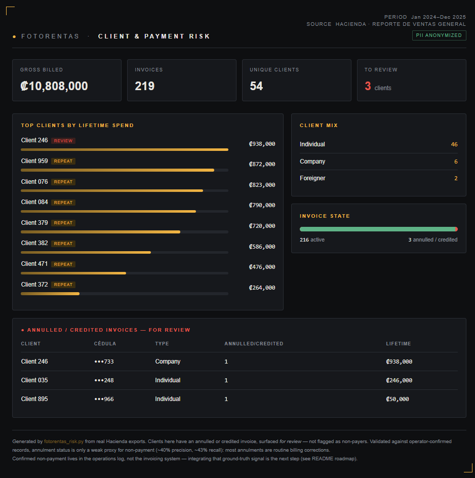

# Fotorentas - Client & Payment-Risk Dashboard

A small, focused Python tool that turns a Costa Rican electronic-invoicing
export (Hacienda *"Reporte de ventas general"*) into a client-level risk and
revenue view, and renders it as a self-contained HTML dashboard.

> **Design philosophy:** this is deliberately **not** a fraud detector. It was
> built for a real high-value equipment-rental business with an extraordinarily
> clean loss record, where a heavyweight fraud-scoring engine would be a control
> wildly oversized for the actual risk. Right-sizing controls to real risk, and
> building privacy in by default is the point.



---

## Context

Fotorentas has rented cameras, lenses, and drones for **9 years** (since 2017)
with **no security deposit**, using social proof and direct-contact screening
instead of deposits or credit checks. Across **~7,060 rentals / ~1,651 clients**,
the lifetime loss record is **one non-returned item and one theft which was
recovered after I spotted it listed on an online marketplace and worked with the
OIJ (Costa Rica's investigative police) to get it back.** So the genuine,
recurring concern in the data isn't fraud rings, it's the occasional non-paying
client, and telling those apart from routine billing noise.

*(The data shipped in this repo is **synthetic** (fake names and fake cédulas)
so the tool runs publicly without exposing real customer PII. It has been
validated on two full years of real exports; real files are never committed.
See [Privacy](#privacy).)*

## What this project found (and why it matters)

The obvious place to look for non-payment is the invoice **status** annulled
invoices (`Anulada`) and credit notes (`Nota de Crédito`). I tested that
assumption against ground truth (the operator's own manually-confirmed
non-payers) across ~1,200 invoices:

| Signal | Precision | Recall |
|--------|-----------|--------|
| Invoice status (Anulada / Nota de Crédito) | **~40%** | **~43%** |

It's a **poor** detector: most annulments are routine billing corrections (wrong
recipient, amount adjustments) by clients who paid, and it misses many real
non-payers who were simply never invoiced. The reliable signal is the operations
log, not the accounting system. Measuring a tempting signal against ground truth
before trusting it (and then surfacing annulments *for review* rather than as a
verdict) is the core idea behind this tool.

## What it does

- **Reads the real, messy export.** Dynamically locates the header beneath
  Hacienda's multi-row preamble, normalizes accented / `°` column names, and
  handles dates whether they arrive as datetimes or raw Excel serials.
- **Resolves clients by cédula.** Rolls every invoice up to one record per
  national ID, separating repeat clients from one-timers and individuals
  (*física*) from companies (*jurídica*) and foreigners (*extranjero*).
- **Annulment review, not false verdicts.** Annulled / credited invoices are
  surfaced **for review** deliberately *not* labeled as non-payment, because
  (see above) that status is only a weak proxy. The reliable non-payer signal is
  integrated from the operations log (roadmap).
- **Privacy by default.** Customer names and cédulas are anonymized unless you
  explicitly pass `--show-pii`.
- **Self-contained output.** One HTML file, no servers, no dependencies to view.

## Skills demonstrated

Real-world data cleaning · identity resolution & aggregation (pandas) · regex
parsing of free-text fields · risk tiering & rule design · PII anonymization ·
`argparse` CLI · HTML/CSS reporting · clear documentation.

## Quickstart

```bash
pip install pandas openpyxl
python3 fotorentas_risk.py sample_data/ventas_sample.xlsx -o dashboard.html
open dashboard.html        # macOS  (use xdg-open on Linux / start on Windows)
```

Run it on your own export (private use, real names + full cédulas):

```bash
python3 fotorentas_risk.py mi_export_real.xlsx --show-pii -o privado.html
```

| Flag | Default | Description |
|------|---------|-------------|
| `input` | - | Hacienda *Reporte de ventas general* `.xlsx` |
| `-o, --output` | `fotorentas_dashboard.html` | Output HTML path |
| `--show-pii` | off | Disable anonymization **private use only** |

## Privacy

- **Anonymization is on by default.** Names become stable `Client NNN` IDs;
  cédulas are masked to their last three digits.
- **Real exports stay out of version control.** A real two-year export contains
  thousands of real national-ID numbers and must never be committed, only the
  synthetic `sample_data/` fixture lives here. Add your real files to
  `.gitignore`.

## Roadmap

- **v2 : ground-truth non-payer signal.** Ingest the operations log's
  manually-confirmed non-payers (joined on reservation number) as the
  authoritative watchlist, with invoice-status annulments kept only as a
  secondary "review" hint. This is the direct consequence of the precision
  finding above.
- **v2 : equipment analytics.** Same join adds revenue-per-item,
  revenue-per-brand, and utilization views.
- **v3 : SQL backend.** Load into SQLite and expose the analysis through SQL.

## Author

**César B. Miranda** - Fraud / Trust & Safety / Risk operations, now automated
with Python. · [LinkedIn](https://www.linkedin.com/in/cbadilla/)

*Built on 9 years of running Fotorentas (Servicios XBM S.A.).*
